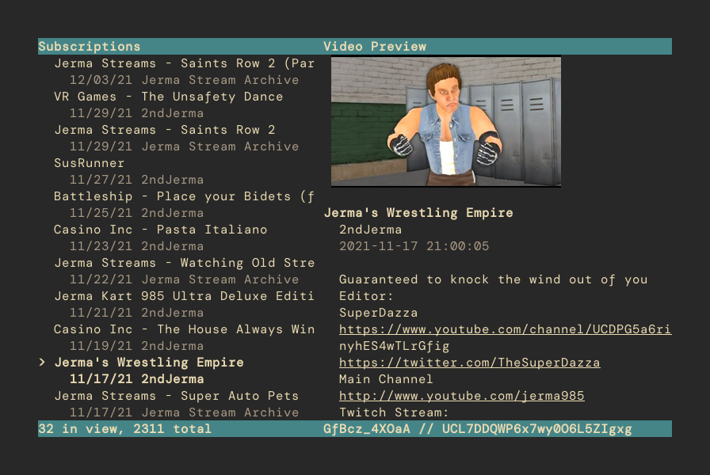

# tyts

Fetch and watch YouTube RSS feeds in the terminal, no API key needed.

## Installation, Usage

1. Depends `ueberzug`, `xdg`, `beautifulsoup4`. Install with pip.
2. Clone this repository
3. Run `tyts.py --create-config` to create an empty config file at `$XDG_CONFIG_HOME/tyts/tyts.json`
4. Add [YouTube channel IDs](https://stackoverflow.com/questions/14366648/how-can-i-get-a-channel-id-from-youtube) into the `channel` array in `tyts.json`
5. Run `tyts.py`, press `r` to load RSS feeds.

Note that YouTube RSS feeds only return the latest 15 videos, but tyts will save and add to that list.

### Controls

| Key | Action |
| --- | --- |
| r | fetch RSS feeds |
| j, k | move video selection down/up |
| u, i | scroll description down/up |
| Enter | open video with mailcap specified command |
| o | open video in browser |
| / | search for text in video title/creator |
| Shift+/ | search by regex in video title/creator |
